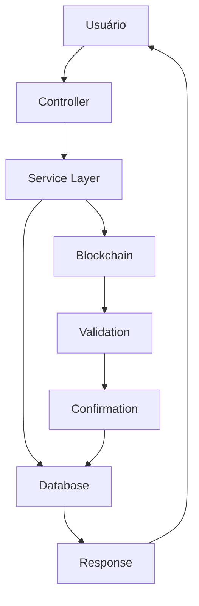

# 💸 **Sistema de Saque via Solana - Guia de Integração Técnica**

## 📋 **Visão Geral da Arquitetura**

Este documento detalha a implementação técnica completa do sistema de saque via Solana, incluindo arquitetura, fluxos de dados, validações de segurança e integração de APIs.

---

## 🏗️ **Arquitetura do Sistema**

### **Componentes Principais**

```
┌─────────────────┐    ┌─────────────────┐    ┌─────────────────┐
│   Controller    │    │    Service      │    │   Database      │
│                 │    │                 │    │                 │
│ - BalanceCtrl   │◄──►│ - BalanceSvc    │◄──►│ - Users         │
│ - UserCtrl      │    │ - UserSvc       │    │ - WithdrawReq   │
│                 │    │ - SolanaValSvc  │    │ - BalanceTxn    │
└─────────────────┘    └─────────────────┘    └─────────────────┘
                              │
                              ▼
                       ┌─────────────────┐
                       │   Blockchain    │
                       │   (Solana)      │
                       └─────────────────┘
```

### **Fluxo de Dados**



---

## 🔧 **Implementação Técnica**

### **1. Configuração da Carteira do Usuário**

#### **Endpoint: `POST /api/v1/user/config/me`**

**Parâmetros:**
```typescript
interface UpdateConfigUserDto {
  walletAddress: string;  // Carteira Solana (44 chars base58)
  username?: string;      // Opcional
  email?: string;         // Opcional
}
```

**Validações:**
```typescript
// Formato da carteira Solana
@Matches(/^[1-9A-HJ-NP-Za-km-z]{44}$/, {
  message: 'Carteira deve ser um endereço Solana válido (44 caracteres base58)'
})

// Unicidade da carteira
const existingUser = await prisma.user.findFirst({
  where: {
    walletAddress,
    id: { not: userId }
  }
});
```

**Resposta de Sucesso:**
```json
{
  "success": true,
  "message": "Carteira configurada com sucesso",
  "data": {
    "userId": "user123",
    "walletAddress": "7xKXtg2CW99iVRBZ1W2Gz9n7dHf8GzQGjzJ8LwWJGzQ"
  },
  "timestamp": "2025-09-22T13:30:00.000Z"
}
```

### **2. Saque via Solana Simplificado**

#### **Endpoint: `POST /api/v1/balance/withdraw/solana`**

**Parâmetros:**
```typescript
interface SimpleSolanaWithdrawDto {
  usdAmount: number;      // 0.01 - 5000 USD
  description?: string;   // Opcional, max 100 chars
}
```

#### **Fluxo de Execução Completo**

##### **2.1 Pré-validações (Rate Limiting)**

```typescript
// Rate limit: 5 saques/dia por usuário
const last24HoursWithdraws = await this.prisma.withdrawRequest.count({
  where: {
    userId,
    createdAt: {
      gte: new Date(Date.now() - 24 * 60 * 60 * 1000)
    }
  }
});

if (last24HoursWithdraws >= 5) {
  throw new BadRequestException('Limite diário de saques atingido');
}

// Bloqueio de saques pendentes
const existingPendingWithdraw = await this.prisma.withdrawRequest.findFirst({
  where: {
    userId,
    status: { in: ['PENDING', 'PROCESSING', 'SENT'] }
  }
});
```

##### **2.2 Validação de Valor**

```typescript
// Validações rigorosas
if (typeof usdAmount !== 'number' || !isFinite(usdAmount) || isNaN(usdAmount)) {
  throw new BadRequestException('Valor deve ser um número válido');
}

if (usdAmount < 0.01 || usdAmount > 5000) {
  throw new BadRequestException('Valor deve estar entre 0.01 e 5000 USD');
}

// Precisão decimal (máximo 2 casas)
if (usdAmount !== Math.round(usdAmount * 100) / 100) {
  throw new BadRequestException('Valor deve ter no máximo 2 casas decimais');
}
```

##### **2.3 Validação do Usuário e Carteira**

```typescript
// Buscar usuário com carteira
const user = await this.prisma.user.findUnique({
  where: { id: userId },
  select: {
    id: true,
    isActive: true,
    balance: true,
    walletAddress: true
  }
});

// Validações críticas
if (!user) throw new NotFoundException('Usuário não encontrado');
if (!user.isActive) throw new BadRequestException('Conta desativada');
if (!user.walletAddress) {
  throw new BadRequestException('Carteira Solana não configurada');
}
if (user.balance < usdAmount) {
  throw new BadRequestException('Saldo insuficiente');
}
```

##### **2.4 Proteção Anti-Auto-Transferência**

```typescript
// Impedir saque para carteira do servidor
const serverWallet = await this.getServerWalletAddress();
if (user.walletAddress === serverWallet) {
  throw new BadRequestException('Não é permitido sacar para carteira do servidor');
}
```

##### **2.5 Cálculo e Persistência**

```typescript
// Obter preço atual do SOL
const solPrice = await this.solanaValidatorService.getSolPriceInUsd();
const solAmount = usdAmount / solPrice;

// Validação de valor mínimo
if (solAmount < 0.001) {
  throw new BadRequestException('Valor muito pequeno, resultaria em menos de 0.001 SOL');
}

// Criar solicitação de saque
const withdrawRequest = await this.prisma.withdrawRequest.create({
  data: {
    userId,
    usdAmount,
    solAmount,
    solPrice,
    destinationWallet: user.walletAddress,
    status: 'PROCESSING',
    expiresAt: new Date(Date.now() + 60 * 60 * 1000), // 1 hora
  }
});
```

##### **2.6 Processamento na Blockchain**

```typescript
try {
  // Enviar SOL para carteira do usuário
  const transactionHash = await this.solanaValidatorService.sendSolToWallet(
    user.walletAddress,
    solAmount
  );

  // Atualizar status da transação
  await this.prisma.withdrawRequest.update({
    where: { id: withdrawRequest.id },
    data: {
      status: 'SENT',
      transactionHash
    }
  });

  this.logger.log(`✅ SOL enviado: ${withdrawRequest.id} - TX: ${transactionHash}`);

} catch (error) {
  // Falha crítica - marcar como FAILED
  await this.prisma.withdrawRequest.update({
    where: { id: withdrawRequest.id },
    data: { status: 'FAILED' }
  });

  throw new BadRequestException(`Falha ao enviar SOL: ${error.message}`);
}
```

##### **2.7 Verificação e Confirmação**

```typescript
// Timeout de 30 segundos para verificação
const verificationPromise = this.verifyTransactionAndCompleteWithdraw(
  userId, transactionHash, withdrawRequest.id, withdrawRequest
);

const timeoutPromise = new Promise((_, reject) => {
  setTimeout(() => reject(new Error('Timeout na verificação')), 30000);
});

try {
  await Promise.race([verificationPromise, timeoutPromise]);

  // Sucesso - retornar resultado final
  return {
    userId,
    balance: finalUser.balance,
    currency: 'USD',
    lastUpdated: new Date()
  };

} catch (verificationError) {
  // Fallback: saque enviado mas verificação falhou
  throw new HttpException({
    success: false,
    error: 'Saque enviado mas verificação falhou',
    transactionHash,
    withdrawId: withdrawRequest.id,
    message: 'SOL enviados, mas confirme manualmente'
  }, HttpStatus.REQUEST_TIMEOUT);
}
```

##### **2.8 Método de Verificação Detalhada**

```typescript
private async verifyTransactionAndCompleteWithdraw(
  userId: string,
  transactionHash: string,
  withdrawId: string,
  withdrawRequest: any
): Promise<void> {

  // Suporte a transações simuladas (desenvolvimento)
  if (transactionHash.startsWith('simulated_')) {
    this.logger.warn(`⚠️ Aceitando transação simulada: ${transactionHash}`);
  } else {
    // Validação completa na blockchain
    const validationResult = await this.solanaValidatorService.validateSolFeeTransaction(
      transactionHash,
      withdrawRequest.destinationWallet,
      withdrawRequest.solAmount.toString(),
      Math.floor(withdrawRequest.createdAt.getTime() / 1000),
      withdrawRequest.solPrice
    );

    if (!validationResult.isValid) {
      throw new BadRequestException(`Transação inválida: ${validationResult.error}`);
    }
  }

  // Transação atômica: confirmar saque e debitar saldo
  await this.prisma.$transaction(async (tx) => {
    // Débito do saldo do usuário
    const newBalance = user.balance - withdrawRequest.usdAmount;

    // Atualizar saldo
    await tx.user.update({
      where: { id: userId },
      data: { balance: newBalance }
    });

    // Criar registro da transação
    await tx.balanceTransaction.create({
      data: {
        userId,
        type: 'WITHDRAWAL',
        amount: -withdrawRequest.usdAmount,
        description: `Saque via Solana: ${withdrawRequest.solAmount.toFixed(6)} SOL`,
        status: 'COMPLETED',
        transactionHash,
        solAmount: withdrawRequest.solAmount,
        usdAmount: withdrawRequest.usdAmount,
        solPrice: withdrawRequest.solPrice,
        senderWallet: withdrawRequest.destinationWallet,
        referenceId: withdrawId
      }
    });

    // Marcar solicitação como confirmada
    await tx.withdrawRequest.update({
      where: { id: withdrawId },
      data: { status: 'CONFIRMED' }
    });
  });

  // Log de auditoria
  this.securityService.logEvent(
    'solana_withdraw_confirmed',
    `Saque Solana confirmado: $${withdrawRequest.usdAmount} → ${withdrawRequest.solAmount.toFixed(6)} SOL`,
    {
      userId, withdrawId, transactionHash,
      destinationWallet: withdrawRequest.destinationWallet,
      userWalletAddress: withdrawRequest.destinationWallet
    },
    'high',
    null
  );
}
```

---

## 📊 **Estados do Sistema**

### **Estados da Solicitação de Saque**

| Status | Descrição | Transições Permitidas | Ações do Usuário |
|--------|-----------|----------------------|------------------|
| `PENDING` | Criada, aguardando processamento | → PROCESSING | Cancelar |
| `PROCESSING` | SOL sendo enviado | → SENT / FAILED | Aguardar |
| `SENT` | SOL enviado, aguardando confirmação | → CONFIRMED / EXPIRED | Verificar manualmente |
| `CONFIRMED` | Saque confirmado e saldo debitado | - | ✅ Completo |
| `FAILED` | Falha no envio | - | Tentar novamente |
| `EXPIRED` | Solicitação expirada | - | Criar nova |
| `CANCELLED` | Cancelada pelo usuário | - | - |

### **Estados da Transação**

| Status | Descrição | Impacto no Saldo |
|--------|-----------|------------------|
| `PENDING` | Transação iniciada | Sem impacto |
| `COMPLETED` | Transação confirmada | Débito realizado |
| `FAILED` | Transação falhou | Sem impacto |
| `CANCELLED` | Transação cancelada | Sem impacto |

---

## 🔐 **Sistema de Segurança**

### **Validações de Integridade**

#### **Rate Limiting**
```typescript
// Por usuário (5 saques/dia)
const userWithdraws = await prisma.withdrawRequest.count({
  where: {
    userId,
    createdAt: { gte: new Date(Date.now() - 24 * 60 * 60 * 1000) }
  }
});

// Global (anti-spam - 30 segundos entre solicitações)
const recentRequests = await prisma.withdrawRequest.findMany({
  where: {
    userId,
    createdAt: { gte: new Date(Date.now() - 30 * 1000) }
  }
});
```

#### **Validação de Carteiras**
```typescript
// Formato base58 de 44 caracteres
@Matches(/^[1-9A-HJ-NP-Za-km-z]{44}$/, {
  message: 'Carteira deve ser um endereço Solana válido'
})

// Unicidade (uma carteira por usuário)
const existingUser = await prisma.user.findFirst({
  where: { walletAddress, id: { not: userId } }
});

if (existingUser) {
  throw new BadRequestException('Esta carteira já está em uso');
}
```

#### **Validação Blockchain**
```typescript
// Verificação completa da transação
const validationResult = await solanaValidatorService.validateSolFeeTransaction(
  transactionHash,
  destinationWallet,
  expectedSolAmount,
  timestamp,
  solPrice
);

// Verificação de hash único
const existingTransaction = await prisma.balanceTransaction.findFirst({
  where: { transactionHash }
});
```

### **Auditoria e Logs**

#### **Eventos de Segurança**
```typescript
// Níveis de severidade
enum SecuritySeverity {
  LOW = 'low',      // Consultas, depósitos pequenos
  MEDIUM = 'medium', // Saques, grandes transações
  HIGH = 'high'      // Falhas críticas, ajustes administrativos
}

// Log estruturado
this.securityService.logEvent(
  'solana_withdraw_confirmed',
  `Saque Solana confirmado: $${usdAmount} → ${solAmount} SOL`,
  {
    userId, withdrawId, transactionHash,
    destinationWallet, usdAmount, solAmount
  },
  'high',
  request
);
```

---

## 🛠️ **Integração Técnica**

### **1. Configuração da Carteira**

```javascript
// Frontend - Configurar carteira
async function configureWallet(walletAddress) {
  try {
    const response = await fetch('/api/v1/user/config/me', {
      method: 'POST',
      headers: {
        'Content-Type': 'application/json',
        'Authorization': `Bearer ${jwtToken}`
      },
      body: JSON.stringify({ walletAddress })
    });

    const result = await response.json();

    if (result.success) {
      console.log('Carteira configurada:', result.data.walletAddress);
      return result.data;
    }

  } catch (error) {
    console.error('Erro na configuração:', error);
    throw error;
  }
}
```

### **2. Realizar Saque**

```javascript
// Frontend - Realizar saque
async function withdrawSolana(usdAmount, description = '') {
  try {
    const response = await fetch('/api/v1/balance/withdraw/solana', {
      method: 'POST',
      headers: {
        'Content-Type': 'application/json',
        'Authorization': `Bearer ${jwtToken}`
      },
      body: JSON.stringify({ usdAmount, description })
    });

    const result = await response.json();

    if (result.userId) {
      console.log(`✅ Saque realizado! Novo saldo: $${result.balance}`);
      return {
        success: true,
        newBalance: result.balance,
        timestamp: result.lastUpdated
      };
    }

  } catch (error) {
    // Tratamento de timeout (fallback)
    if (error.status === 408) {
      console.log('⏳ Saque enviado, confirme manualmente');
      console.log('Transaction Hash:', error.transactionHash);
      console.log('Withdraw ID:', error.withdrawId);

      return {
        success: true,
        pending: true,
        transactionHash: error.transactionHash,
        withdrawId: error.withdrawId
      };
    }

    console.error('Erro no saque:', error);
    throw error;
  }
}
```

### **3. Verificar Status de Saques**

```javascript
// Frontend - Listar saques
async function getWithdrawRequests(status = 'ALL') {
  try {
    const params = status !== 'ALL' ? `?status=${status}` : '';
    const response = await fetch(`/api/v1/balance/withdraw/solana/requests${params}`, {
      headers: {
        'Authorization': `Bearer ${jwtToken}`
      }
    });

    const requests = await response.json();
    return requests;

  } catch (error) {
    console.error('Erro ao buscar saques:', error);
    throw error;
  }
}
```

### **4. Verificação Manual (Fallback)**

```javascript
// Frontend - Verificar saque manualmente
async function verifyWithdrawManually(withdrawId, transactionHash) {
  try {
    const response = await fetch('/api/v1/balance/deposit/solana/verify', {
      method: 'POST',
      headers: {
        'Content-Type': 'application/json',
        'Authorization': `Bearer ${jwtToken}`
      },
      body: JSON.stringify({
        depositId: withdrawId,
        transactionHash
      })
    });

    const result = await response.json();

    if (result.userId) {
      console.log('✅ Saque verificado manualmente!');
      return result;
    }

  } catch (error) {
    console.error('Erro na verificação manual:', error);
    throw error;
  }
}
```

---

## 📈 **Monitoramento e Métricas**

### **KPIs Principais**

```javascript
// Taxa de sucesso de saques
const successRate = (confirmedWithdraws / totalWithdraws) * 100;

// Tempo médio de processamento
const avgProcessingTime = totalProcessingTime / totalWithdraws;

// Taxa de fallback
const fallbackRate = (timeoutWithdraws / totalWithdraws) * 100;
```

### **Alertas de Monitoramento**

```javascript
// Alertas automáticos
const alerts = {
  // Taxa de sucesso baixa
  lowSuccessRate: (rate) => rate < 95 && 'Taxa de sucesso baixa',

  // Tempo de processamento alto
  slowProcessing: (avgTime) => avgTime > 60000 && 'Processamento lento',

  // Muitos fallbacks
  highFallbackRate: (rate) => rate > 5 && 'Muitos fallbacks',

  // Rate limit atingido frequentemente
  rateLimitHits: (count) => count > 10 && 'Rate limit frequente'
};
```

### **Logs Estruturados**

```javascript
// Log de aplicação
this.logger.log(`🚀 Iniciando saque: ${userId} - $${usdAmount} → ${solAmount} SOL`);
this.logger.log(`✅ SOL enviado: ${withdrawRequest.id} - TX: ${transactionHash}`);
this.logger.log(`✅ Saque confirmado: ${userId} - $${usdAmount} → ${solAmount} SOL`);

// Log de erro
this.logger.error(`❌ Erro no saque ${withdrawRequest.id}:`, error);

// Log de segurança
this.securityService.logEvent('solana_withdraw_failed', error.message, {
  userId, usdAmount, error: error.message
}, 'high', request);
```

---

## 🧪 **Testes e Qualidade**

### **Cenários de Teste**

#### **Testes Unitários**
```typescript
describe('WithdrawSolana', () => {
  it('should validate wallet address', async () => {
    const invalidWallet = 'invalid-wallet';
    await expect(withdrawService.withdrawSolana(userId, {
      usdAmount: 10,
      description: 'Test'
    })).rejects.toThrow('Carteira Solana não configurada');
  });

  it('should prevent rate limit abuse', async () => {
    // Simular 5 saques em 24h
    await expect(withdrawService.withdrawSolana(userId, {
      usdAmount: 10
    })).rejects.toThrow('Limite diário de saques atingido');
  });

  it('should validate amount precision', async () => {
    await expect(withdrawService.withdrawSolana(userId, {
      usdAmount: 10.123 // Mais de 2 casas decimais
    })).rejects.toThrow('Valor deve ter no máximo 2 casas decimais');
  });
});
```

#### **Testes de Integração**
```typescript
describe('Withdraw Flow Integration', () => {
  it('should complete full withdraw flow', async () => {
    // 1. Setup user with wallet
    await userService.update(userId, { walletAddress: validWallet });

    // 2. Add balance
    await balanceService.addBalance(userId, 100);

    // 3. Perform withdraw
    const result = await withdrawService.withdrawSolana(userId, {
      usdAmount: 10
    });

    // 4. Verify final state
    expect(result.balance).toBe(90);
    expect(result.currency).toBe('USD');
  });

  it('should handle blockchain timeout gracefully', async () => {
    // Simular timeout na verificação
    jest.spyOn(solanaValidator, 'validateSolFeeTransaction')
      .mockImplementation(() => new Promise(resolve => setTimeout(resolve, 35000)));

    await expect(withdrawService.withdrawSolana(userId, {
      usdAmount: 10
    })).rejects.toThrow('Timeout na verificação');
  });
});
```

### **Testes de Stress**

```typescript
describe('Stress Tests', () => {
  it('should handle concurrent withdraw requests', async () => {
    const promises = Array(10).fill().map(() =>
      withdrawService.withdrawSolana(userId, { usdAmount: 1 })
    );

    const results = await Promise.allSettled(promises);
    const successful = results.filter(r => r.status === 'fulfilled').length;

    expect(successful).toBeLessThanOrEqual(1); // Apenas 1 deve passar (rate limit)
  });
});
```

---

## 🚀 **Performance e Escalabilidade**

### **Otimização de Queries**

```typescript
// Query otimizada com selects específicos
const user = await this.prisma.user.findUnique({
  where: { id: userId },
  select: {
    id: true,
    isActive: true,
    balance: true,
    walletAddress: true // Apenas campos necessários
  }
});
```

### **Cache Estratégico**

```typescript
// Cache do preço do SOL (5 minutos)
@Injectable()
export class SolanaPriceCache {
  private cache = new Map<string, { price: number; timestamp: number }>();

  async getPrice(): Promise<number> {
    const cached = this.cache.get('SOL_PRICE');
    if (cached && Date.now() - cached.timestamp < 5 * 60 * 1000) {
      return cached.price;
    }

    const price = await this.fetchFreshPrice();
    this.cache.set('SOL_PRICE', { price, timestamp: Date.now() });
    return price;
  }
}
```

### **Processamento Paralelo**

```typescript
// Processamento assíncrono de verificações
const verificationPromises = withdrawRequests.map(request =>
  this.verifyTransactionAndCompleteWithdraw(userId, request.transactionHash, request.id, request)
);

await Promise.allSettled(verificationPromises);
```

---

## 📚 **Referências Técnicas**

### **Dependências Principais**
- `@nestjs/common` - Framework base
- `@prisma/client` - ORM de banco
- `class-validator` - Validações de entrada
- `@solana/web3.js` - Cliente blockchain

### **Configurações Ambiente**
```env
# Database
DATABASE_URL=postgresql://...

# Solana
SOLANA_RPC_URL=https://api.mainnet.solana.com
SOLANA_PRIVATE_KEY=your_server_private_key

# Security
JWT_SECRET=your_jwt_secret
```

### **Estrutura do Banco**

```sql
-- Usuários com carteira
CREATE TABLE users (
  id UUID PRIMARY KEY,
  wallet_address VARCHAR(44) UNIQUE,
  balance DECIMAL(10,2) DEFAULT 0,
  is_active BOOLEAN DEFAULT true
);

-- Solicitações de saque
CREATE TABLE withdraw_requests (
  id UUID PRIMARY KEY,
  user_id UUID REFERENCES users(id),
  usd_amount DECIMAL(10,2),
  sol_amount DECIMAL(10,6),
  sol_price DECIMAL(10,4),
  destination_wallet VARCHAR(44),
  transaction_hash VARCHAR(88),
  status withdraw_status,
  expires_at TIMESTAMP,
  created_at TIMESTAMP DEFAULT NOW()
);

-- Transações de saldo
CREATE TABLE balance_transactions (
  id UUID PRIMARY KEY,
  user_id UUID REFERENCES users(id),
  type transaction_type,
  amount DECIMAL(10,2),
  transaction_hash VARCHAR(88),
  sol_amount DECIMAL(10,6),
  usd_amount DECIMAL(10,2),
  sol_price DECIMAL(10,4),
  sender_wallet VARCHAR(44),
  reference_id UUID, -- ID da withdraw_request
  created_at TIMESTAMP DEFAULT NOW()
);
```

---

## 🎯 **Checklist de Implementação**

### **Pré-requisitos**
- ✅ Schema do banco atualizado
- ✅ Carteiras de servidor configuradas
- ✅ Conexão Solana estabelecida
- ✅ Sistema de logs configurado

### **Funcionalidades Core**
- ✅ Configuração de carteira do usuário
- ✅ Validações de segurança implementadas
- ✅ Processamento automático de saques
- ✅ Verificação blockchain integrada
- ✅ Sistema de fallback funcional

### **Qualidade**
- ✅ Testes unitários implementados
- ✅ Testes de integração realizados
- ✅ Documentação técnica completa
- ✅ Monitoramento e alertas configurados

### **Performance**
- ✅ Queries otimizadas
- ✅ Rate limiting implementado
- ✅ Cache estratégico aplicado
- ✅ Processamento paralelo habilitado

---

*Este guia técnico serve como referência completa para implementação, manutenção e troubleshooting do sistema de saque via Solana. Mantenha-o atualizado conforme novas funcionalidades são adicionadas.*
